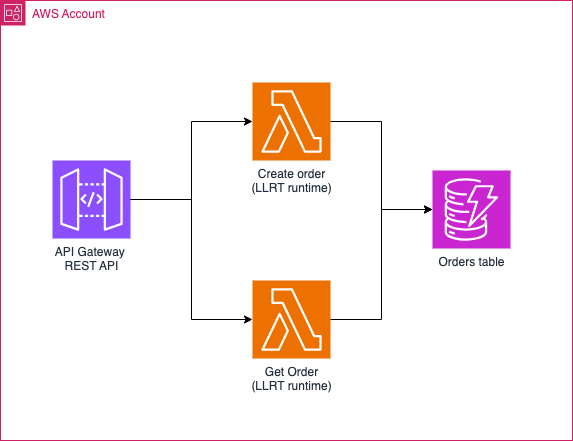

# LLRT with terraform sample

This repo provides a working sample of a serverless aws lambda based application that uses [LLRT javascript](https://github.com/awslabs/llrt) runtime. This sample includes also a fully working IaC with terraform.

This project can serve as a template for new serverless applications leveraging:

- [LLRT runtime](https://github.com/awslabs/llrt)
- along with typescript
- and terraform

## sample architecture overview

.

## Building Deploying this sample

TODO
