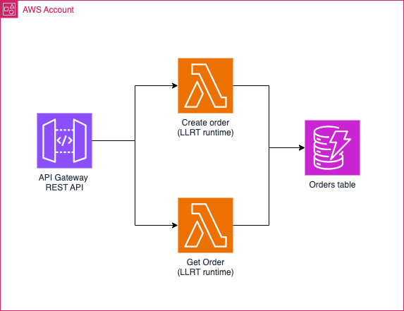

# LLRT with terraform sample

This repo provides a working sample of a serverless aws lambda based application that uses [LLRT javascript](https://github.com/awslabs/llrt) runtime. This sample includes also a fully working IaC with terraform.

This project can serve as a template for new serverless applications using:

- [LLRT runtime](https://github.com/awslabs/llrt)
- with typescript
- and terraform

> [!WARNING]
> LLRT is an experimental runtime and not fully compatible with Node.js. Some modules are not expected to work properly. You can find more on the Node.js/LLRT compatibility matrix here [here](https://github.com/awslabs/llrt?tab=readme-ov-file#compatibility-matrix)

## sample architecture overview

<p align="center">
    
</p>

## Repository Organization

- `infra/`: IaC with terraform.
- `src/`: The source code of the lambda functions in typescript:

    * [build.sh](./src/build.sh) build script that: 
    
        * Downloads the LLRT from the official LLRT github repo
        * Bundles lambda code with esbuild
        * Adds the LLRT bootstrap to the build output
    * [esbuild.config.js](./src/esbuild.config.js) The esbuild config
    * [orders](./src/orders/): Sample code that performs super basic CR~~UD~~ operations 


## Building & deploying this sample

```
# building the project

npm --prefix ./src install
npm --prefix ./src run build

# deploying the project

terraform -chdir=./infra init
terraform -chdir=./infra validate
terraform -chdir=./infra apply

```

> [!NOTE]  
> A fully functional sample github pipeline coming next
